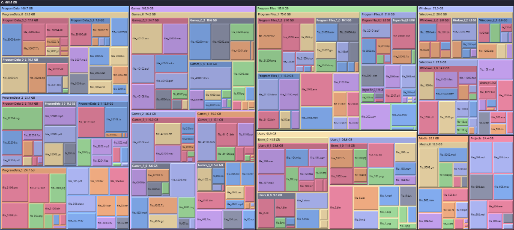
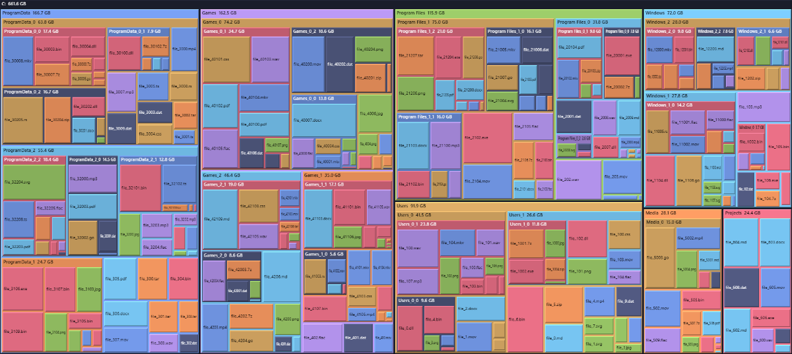
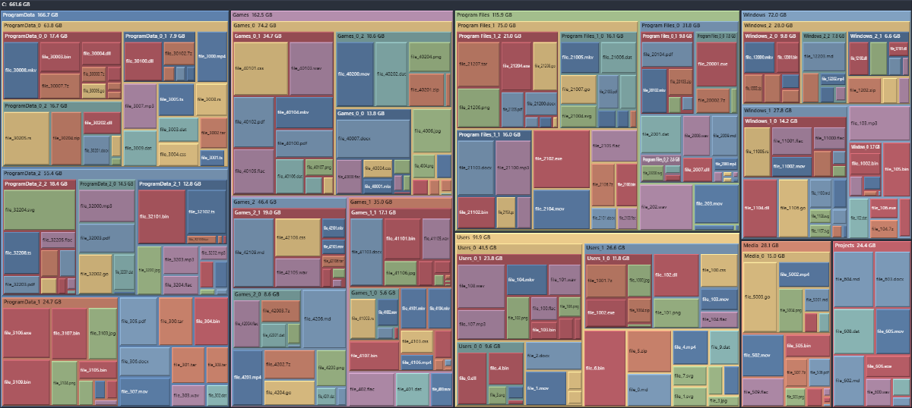
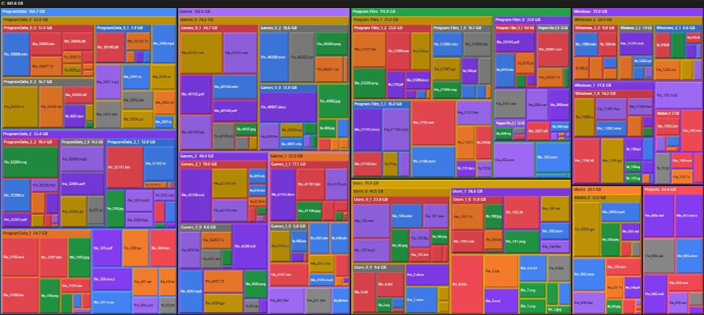
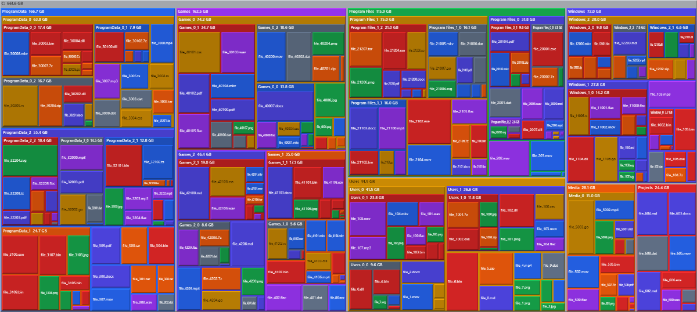
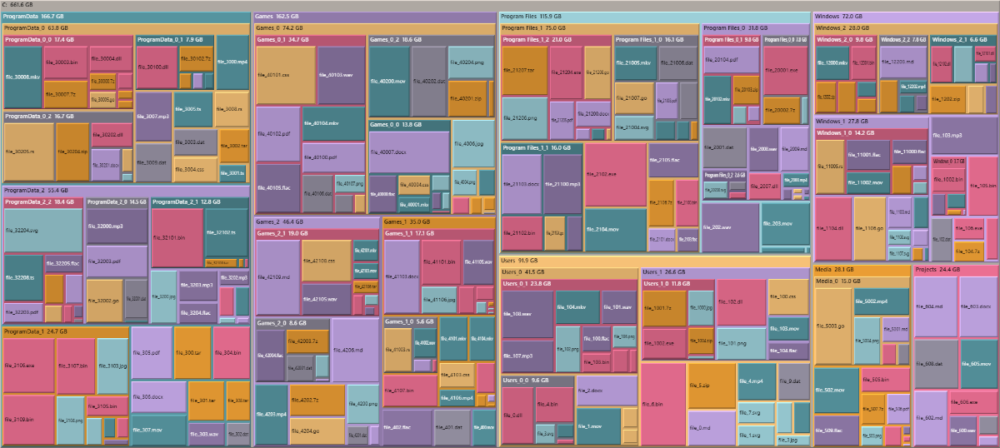
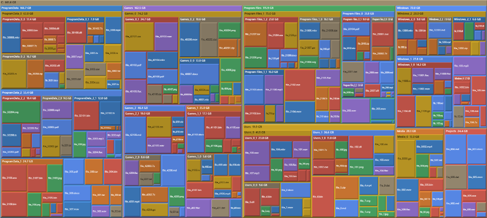

# cushion-treemap

> **AI-Assisted Development** — Significant portions of this codebase were written with AI assistance (Claude Opus 4.8, Claude Sonnet 4.6). See commit history for details.

A zero-dependency, framework-agnostic **cushion treemap** renderer for the HTML
canvas — with a built-in switchable **theme system**.

Cushion treemaps (van Wijk & van de Wetering, InfoVis 1999) shade each tile as a
ridged surface so the directory hierarchy reads as nested 3-D pillows instead of
flat rectangles. This implementation does squarified layout (Bruls et al. 2000)
and per-pixel lighting via `ImageData` — no SVG, no chart library, no React.

## Themes

All seven built-in themes, shown in **category** color mode (files tinted by
extension) on the same synthetic-disk dataset. Switch at runtime with
`tm.setTheme(getTheme(name)!)`.

| Catppuccin Mocha · *dark* | Tokyo Night · *dark* |
|:---:|:---:|
|  |  |
| **Nord · *dark*** | **Carbon · *dark*** |
|  |  |
| **Clean Light · *light*** | **Rosé Pine Dawn · *light*** |
|  |  |
| **Manila · *light* — SpaceSniffer homage** | |
|  | |

The folder/file two-tone look (`colorMode: 'folder-file'`) renders the same themes
with one color for folders and one for files.

## Demo

- **Live:** **[sabihismail.github.io/cushion-treemap](https://sabihismail.github.io/cushion-treemap)** — runs in the browser, no install.
- **Offline:** grab [`cushion-treemap-demo.html`](https://github.com/sabihismail/cushion-treemap/raw/main/cushion-treemap-demo.html) — a single self-contained file (engine inlined, ~25 KB). Download and double-click; it works from `file://` with no server.

Both demos share one source (`demo/`) and include a **theme switcher** (all 6 themes + Auto/system), three sample datasets (synthetic disk, `node_modules` bloat, a non-file solar-system tree), drill-in zoom with breadcrumbs, and **drag-and-drop / "Import JSON"** so you can drop in your own tree. Native shape is `{ name, value, children }`, and the importer also adapts common disk-scan dumps (`size_bytes`/`size`/`bytes`, `node_type`/`is_dir`). Use **Download sample** to see the exact JSON shape.

## Features

- **One file, zero deps.** Pure TypeScript + the 2D canvas context.
- **Bring any framework — or none.** Hand it a `<canvas>` and a tree.
- **Squarified layout** with stable, near-square tiles and depth-decaying ridges.
- **Two color modes** — color files by extension *category*, or a SpaceSniffer-style
  *folder/file* two-tone (one color for folders, one for files).
- **Two cushion styles** — smooth per-pixel *ridge*, or a crisp SpaceSniffer-style *bevel*.
- **Hover glow, fade-in animation, and per-type accent tags** for a cute, crisp finish.
- **7 built-in themes** (Catppuccin Mocha, Clean Light, Nord, Tokyo Night,
  Rosé Pine Dawn, Carbon, and **Manila** — a SpaceSniffer homage) + a `Theme`
  type to author your own.
- **System-aware theming** (`prefers-color-scheme`) and CSS-variable projection
  for surrounding DOM chrome.
- **Luminance-aware labels** that stay readable on light *and* dark tiles.
- **Lazy expansion + drill-in zoom** via simple callbacks.

## Install

```bash
npm install cushion-treemap
```

## Quick start

```ts
import { CushionTreemap, applyThemeVars, getTheme } from 'cushion-treemap'

const canvas = document.querySelector('canvas')!
const tm = new CushionTreemap(canvas)

tm.setData({
  name: 'root',
  value: 0,                       // value is ignored for the root container
  children: [
    { name: 'video.mp4', value: 4_200_000_000 },
    { name: 'src', value: 0, children: [
      { name: 'index.ts', value: 12_000 },
      { name: 'style.css', value: 4_000 },
    ]},
  ],
})

// Size the canvas to its container (call on resize too):
tm.resize(canvas.clientWidth, canvas.clientHeight)
```

A node is a **directory** when it has a non-empty `children` array. Files are
colored by extension category; directories by a depth-cycled palette derived from
the active theme.

## Theming

```ts
import { THEMES, getTheme, applyThemeVars, resolveSystemThemeName } from 'cushion-treemap'

// Switch the canvas theme (recolors + repaints, no layout recompute):
tm.setTheme(getTheme('Nord')!)

// Follow the OS color scheme:
tm.setTheme(getTheme(resolveSystemThemeName())!)

// Project theme colors onto CSS variables for your own toolbar/legend/tooltip:
applyThemeVars(getTheme('Nord')!)
// → sets --ct-bg --ct-header --ct-text --ct-text-dim --ct-border
//   and --ct-cat-video … --ct-cat-other on <html>
```

Author a custom theme by passing any object that satisfies the exported `Theme`
interface to `new CushionTreemap(canvas, { theme })` or `tm.setTheme(theme)`.

## Interaction

```ts
tm.onHover     = (node, x, y) => { /* show a tooltip */ }
tm.onExpand    = (node)       => { /* single-click a dir: lazy-load children */ }
tm.onOpenFile  = (path, node) => { /* double-click a file */ }

// Built-in zoom (optional):
tm.drillIn(dirNode)   // zoom into a directory
tm.drillOut()         // back out one level
```

For lazy-loaded trees, set `children` to an empty array while fetching, then
re-call `tm.setData(root)` once children arrive.

## Options

```ts
new CushionTreemap(canvas, {
  theme,                       // Theme object (default: Catppuccin Mocha)
  minPx: 3,                    // skip tiles smaller than this
  headerHeight: 20,            // directory header strip height (px)
  padding: 2,                  // gap between tiles (px)
  fontFamily: '…',             // label font
  isDir: (n) => n.kind === 'dir',          // custom directory predicate
  categoryForNode: (n) => 'code',          // custom color category
  colorMode: 'category',                   // 'category' | 'folder-file'
  cushionStyle: 'ridge',                   // 'ridge' | 'bevel'
  accentTags: false,                       // folder-file: per-type corner tags
  animate: true,                           // fade-in + hover glow
})

// All four are also live setters (no rebuild of the tree):
tm.setColorMode('folder-file')   // SpaceSniffer two-tone
tm.setCushionStyle('bevel')      // crisp beveled tiles
tm.setAccentTags(true)           // per-type corner tags on files
tm.setTheme(getTheme('Manila')!) // SpaceSniffer-style palette
```

`CushionTreemap<T>` is generic over your node type — `T` must extend
`{ name: string; value: number; children?: T[]; path?: string }`. All callbacks
hand you back your own `T`.

## Generic node type

```ts
interface TreemapNode {
  name: string
  value: number          // size; tile area is proportional to this
  children?: TreemapNode[]
  path?: string          // optional id passed to onOpenFile
}
```

## Development

```bash
npm install
npm run dev        # runnable demo with synthetic data + theme switcher
npm run demo       # same demo (alias of dev)
npm run demo:build # build both demo outputs: dist-demo/ (Pages) + cushion-treemap-demo.html (offline)
npm test           # unit tests (node:test via tsx)
npm run build      # bundle to dist/ (ESM + CJS + .d.ts) via tsup
npm run typecheck
```

## Credits

**Algorithms**
- Cushion shading: J.J. van Wijk & H. van de Wetering, *Cushion Treemaps*, InfoVis 1999.
- Squarified layout: M. Bruls, K. Huizing & J.J. van Wijk, *Squarified Treemaps*, 2000.

**Palettes.** The built-in themes reproduce color values from the following
permissively-licensed color systems. Only the hex values are used — color values
are facts and not themselves copyrightable; these credits are offered as a
courtesy to the original authors.

- [Catppuccin](https://catppuccin.com/) — MIT
- [Nord](https://www.nordtheme.com/) — MIT
- [Tokyo Night](https://github.com/folke/tokyonight.nvim) — MIT (originally Apache-2.0 VS Code theme)
- [Rosé Pine](https://rosepinetheme.com/) — MIT
- [Carbon](https://carbondesignsystem.com/) — palette values from the IBM Carbon Design System (Apache-2.0)
- [Tailwind CSS colors](https://tailwindcss.com/docs/colors) — MIT

The **Carbon** theme reproduces IBM Carbon palette values only. It is *not*
affiliated with, sponsored by, or endorsed by IBM, and "IBM" and "Carbon" are
trademarks of their respective owners.

The **Manila** theme and the optional folder/file two-tone color mode are an
independent visual homage to [SpaceSniffer](http://www.uderzo.it/main_products/space_sniffer/)
by Uderzo Umberto — no code or assets are taken from it.

## License

MIT © Sabih Ismail
